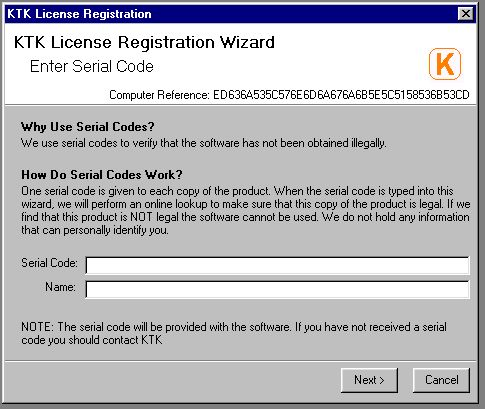



## Product Activation using the Internet  by manually issuing codes\!

### Description

This code will validate each product you distribute to make sure it has not been registered on another computer.

If the wizard detects that the software has already been installed on another computer then it won't allow you complete registration. If the software has not been used for 30 days then it will allow someone else to register it even if it is on another computer.

The file neede to upload onto the Internet is included but if you ask you can use my host just tell me the productID and I can sort it out for you.

There is instructions on how how to issue codes in the readme file.

Some code in this project has been taken from other examples on PlanetSourceCode. I can't remember who I have taken code from. If you recognise any of your code then e-mail me and I will credit you.

If you like this example then please vote for me!
 
### More Info
 

             |
---                |---
**Submitted On**   |2004-08-18 13:00:14
**By**             |[Andrew Roberts](https://github.com/Planet-Source-Code/PSCIndex/blob/master/ByAuthor/andrew-roberts.md)
**Level**          |Advanced
**User Rating**    |5.0 (15 globes from 3 users)
**Compatibility**  |VB 6\.0
**Category**       |[Complete Applications](https://github.com/Planet-Source-Code/PSCIndex/blob/master/ByCategory/complete-applications__1-27.md)
**World**          |[Visual Basic](https://github.com/Planet-Source-Code/PSCIndex/blob/master/ByWorld/visual-basic.md)
**Archive File**   |[Product\_Ac1785808252004\.zip](https://github.com/Planet-Source-Code/andrew-roberts-product-activation-using-the-internet-by-manually-issuing-codes__1-55815/archive/master.zip)

